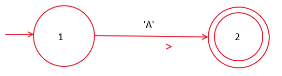
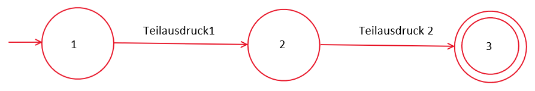
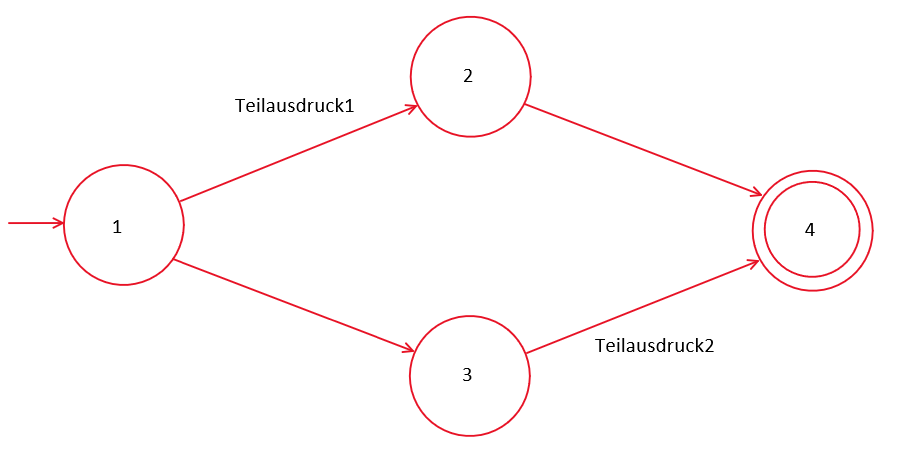

# Projektarbeit-Haskell-Regulaere-Ausdruecke

In diesem Github Repository geht es um die Projekt Arbeit von Jonas E die sich mit der Umsetzung von Diversen Anwendungsfällen rund um Reguläre Ausdrücke in der Programmiersprache Haskell beschäftigt.

Die Aufgabestellungen sind unter https://sulzmann.github.io/SoftwareProjekt/labor.html#(10) zu finden.

Die Einarbeitung in Haskell wurde mit dem Beginner's Guide "Lean you a Haskell" durchgeführt dieser ist unter http://learnyouahaskell.com/ zu finden.

## Haskell Erweiterung & Ausführung des Codes in VS Code

Der Code wurde in Visual Studio Code mit GHC (Glasgow Haskell Compiler) erweiterung entwickelt, diese ist im Marketplace für Visual Studio zu finden https://marketplace.visualstudio.com/items?itemName=haskell.haskell.
Die Haskell Erweiterung wird zum kompilieren und ausführen des Codes verwendet. Für verbessertes Code Highlighting wurde noch eine Haskell Syntax Highlighting Erweiterung verwendet https://marketplace.visualstudio.com/items?itemName=justusadam.language-haskell .

Zur verwendung von GHC muss zuerst in das Projekt Verzeichnis Navigiert werden. Anschliesend kann mit `ghci` die GHC interactive console gestartet werden. Als nächstes muss der Code mit `:l Regs.hs` kompiliert werden.
Nun kann man in der Konsole beliebig Funktionen aufrufen.

## Datenstruktur regulärer ausdruck
Basis für alle Regulären Ausdrücke in diesem Projekt ist die Algebraische datenstruktur "Ausdruck".

    data Ausdruck = Epsilon | Phi | C Char | Alternative Ausdruck Ausdruck | Konkatenation Ausdruck Ausdruck| Sternbildung Ausdruck deriving (Show)

Mithilfe dieser Datenstruktur Lassen sich beliebige gültige Reguläre Ausdrucke erstellen.
Besonders zu beachten ist hierbei die rekursive Struktur des Datentyps möchte man zb.
eine Konkatenation von "A" und "B" darstellen dann besteht dieser aus 3 teil Ausdrücken
aus `C "A"` ,  `C "B"` und `Konkatenation Ausdruck Ausdruck` - dabei fügt man die Teilausdrücke für die Zeichen
in den Ausdruck der konkatenation also hier `Konkatenation (C "A") (C "B")`.
Die klammern müssen gesetzt werden da das erstellen einer konkatenation zwei parameter erwartet und ohne die klammern C und "A" jeweils als ein Parameter interpretiert werden würden.
Alternativ könnte man auch die Teil ausdrücke `C "A"` und `C "B"` in zwei Variablen speichern und stattdessen die 
Variablen angeben also z.b. `let Teil1 = C "A"`, `let Teil2 = C "B"` und dann in die Konkatentation einfügen `Konkatenation Teil1 Teil2`.

### Code Beispiele zum Erstellen von Ausdrücken
Der code zum erstellen des Ausdrucks (A B)* 
   Sternbildung(Konkatenation (C "A") (C "B"))

Ausdruck A A*
   Konkatenation ((C "A") (Sternbildung (C"A"))

Ausdruck A B C
    Konkatenation(Konkatenation((C"A")(C"B")) (C"C"))

Da in unserer Algebraischen Datenstruktur konkatenationen immer zweistellig sind muss für die Konkatenation von 3 zeichen zwei mal Konkateniert werden.

## Funktion Vereinfachung von Regulären Ausdrücken
vereinfachung :: Ausdruck -> Ausdruck

Die funktion nimmt einen Regulären Ausdruck und gibt einen anhand einer Menge von Regeln vereinfachten
Ausdruck zurück. 

    linkeSeite ==> rechteSeite

    eps r ==> r

    r1 r2 ==> phi falls L(r1)={} oder L(r2)={}

    r* ==> eps falls L(r)={}

    (r*)* ==> r*

    r + r ==> r

    r1 + r2 ==> r2 falls L(r1)={}

    r1 + r2 ==> r1 falls L(r2)={}
Vereinfachunsregeln aus der Aufgabenstellung.
Hinweis "+" steht für Alternative und Leerzeichen für Konkatenation

Das Durchschreiten des Ausdrucks erfolgt Rekursiv. Das erkennen welche vereinfachungsregel
angewendet werden soll wird mit Pattern matching erreicht dabei prüft die funktion nacheinander von oben nach
unten in der methode welches pattern übergeben wurde und wendet dann die funktion die hinter dem gleichzeichen steht an, wichtig dabei zu beachten ist das immer nur der Hierarchisch höchstegelegene teil des ausdrucks bei einem durchlauf betrachtet wird. 

### Beispiel mit Code
Gibt man zum beispiel den Ausdruck `Sternbildung (Alternative (C 'A') (C 'A'))` an dann wird im ersten Durchlauf erkannt das es sich um eine Sternbildung mit einem Beliebigen Parameter handelt - da hier keine der Regeln anwendung findet wird Vereinfachung für den hierarchisch daruterliegenden Ausdruck `Alternative (C 'A') (C 'A')` aufgerufen hier wird erkannt das es sich um eine Alternative von zwei gleichen Zeichen handelt daher wird nur `C 'A'` zurückgegeben.
Das Ergebnis ist dann `Sternbildung (C 'A')`.

In der GHCI

    ghci> let ausdruck = Sternbildung (Alternative (C 'A') (C 'A'))
    ghci> let vereinfacht = vereinfachung ausdruck
    ghci> vereinfacht
    Sternbildung (C 'A')

## Funktion Reguläre Ausdrücke in Strings Umwandeln
ausdruckPrinten :: Ausdruck -> String

Mithilfe der Funktion können Reguläre Ausdrücke in Strings zum Ausgeben umgewandelt werden.
Dabei wird wie bei der vorheringen Funktion das durchschreitten rekursiv durchgeführt und das vereinfachen mithilfe von Pattern Matching

In der GHCI

    ghci> ausdruckPrinten (Sternbildung (Konkatenation (C 'A') (C 'B')))
    "(A B)*"

## Datenstruktur transitionen
data Transition = Transition Int Char Int deriving (Show)

Die Datenstruktur wird zum erstellen von Transitionen zur Ausführung in Automaten verwendet.
Dabei steht der erste Int für den Ausgangszustand der Char für das Zeichen das bei der Transition eingesetzt werden soll. Für einen spontanen Übergang wird "-" eingesetzt. Der zweite int steht für den Zielzustand der nach ausführen
der Transition erreicht wird.

Beispiel Transition 1 'A' 2
Ist die Transition vom Zustand 1 mit dem Zeichen "A" in den Zustand 2.

in der GHCI

    ghci> let transition = Transition 1 'A' 2
    ghci> transition
    Transition 1 'A' 2

## Datenstruktur Automat
data Automat = Automat [Transition] Int deriving (Show)

Die Datenstruktur wird zum erstellen von Automaten benutzt.
Ein Automat enthält eine Liste von Transitionen und einen Int für den Endzustand 
des Automaten. Der Startzustand ist immer die 1 daher muss er nicht angegeben werden.
Alle Automaten haben nur einen Start und Endzustand.

Beispiel Automat [Transition 1 'A' 2] 2
in der GHCI

    ghci> let automat = Automat [Transition 1 'A' 2] 2
    ghci> automat
    Automat [Transition 1 'A' 2] 2

## Hilfsfunktionen

Eine Reihe von Hilfsfunktionen die Beim erstellen von Automaten verwendet werden.

zustandsnummernErhöhen :: Automat -> Int -> Automat

Erhöht alle zustandsnummern im Automat um Int und gibt Automat zurück.

Parameter:
* Automat - Automat dessen Zustandsnummern erhöht werden sollen
* Int - Zahl um wieviel die Zustandsnummern erhöht werden sollen
* Automat - Rückgabe des Automaten

trippleListeErhöhen :: [Transition] -> Int -> [Transition]

Erhöht alle zustandsnummern in einer Liste von Tripplen

Parameter:
* [Transition] - Liste von Transitionen der Zustandsnummern erhöht werden sollen
* Int - Zahl um wieviel die Zustandsnummern erhöht werden sollen
* [Transition] - Rückgabe der Liste von Transitionen mti angepassten Zustandsnummern

zustandsnummerInTrippleErhöhen :: Transition -> Int -> Transition

Erhöht alle Zustandsnummern in einem Tripple.

Parameter:
* Transition - Transitionen deren Zustandsnummern erhöht werden sollen
* Int - Zahl um wieviel die Zustandsnummern erhöht werden sollen
* Transition - Rückgabe der Transitionen mit angepassten Zustandsnummern

## Funktion Automat erstellen
Erstellt aus einem Regulären Ausdruck einen Automaten der genutzt werden kann
um zu prüfen ob ein Wort teil des Regulären Ausdrucks ist.
Das durchlaufen des Audrucks erfolgt rekursiv und mithilfe von Pattern matching.
Wichtig beim erstellen des automaten ist das es keine Kreisläufe von Spontanen übergängen geben darf
da sonst das ausführen des Automaten in einer endlos Schleife hängen bleibt.

### Umwandlungsregeln
Der Reguläre Ausdruck wird mithilfe von einingen Umwandlungsregeln in eine menge von Transitionen umgewandelt. Dabei macht man sich den Rekursiven Aufbau der Algebraischen Datenstruktur zu nutze. Die in den folgenden erklärungen verwendeten Zustandsnummern sind Beispielhaft für den Fall das die Teilausdrücke nur aus einer Transition bestehen - liegt mehr als nur eine Transition darunter müssen diese entsprechend angepasst werden.

### C

C - Aus `C 'A'` wird `Transition 1 'A' 2`

*Automat C* 

### Konkatenation

Die Umwandlung einer Konkatenation ist etwas schwieriger. Es wird jeweils rekursiv für die Beiden Teilausdrücke der Konkatenation wider automat erstellen aufgerufen und anschliesend in den ergebnissen der rekursiven teilaufrufe die Zustandsnummern angepasst. Beispiel `Konkatenation teilausdruck1 teilausdruck2`  Teilausdruck 1 und 2 werden hier als `C 'A'`angenommen. D.h. der rekursive aufruf erstellet zunäsht Transitionen für die beiden Teilausdrücke, hier `Transition 1 'A' 2` anschliesend werden diese zurück gegeben und beim zusammenfügen der konkatenation werden die Transitionen aus Teilausdruck 1 übernommen und die Transition aus Teilausdruck 2 werden um Höchste Zustandsnummer aus Teilausdruck 1 minus eins erhöht. Hier also 2 - 1 = 1 , das ergibt dann für den Teilausdruck 2 die `Transition 2 'A' 3`. Sind die Teilausdrücke komplexer müssen von entsprechend mehr daruter liegenden Transitionen die Zustandsnummern angepasst werden.

*Automat Konkatenation* 

### Sternbildung

Bei der Sternbildung müssen einige zusätzliche Übergange eingefügt werden um zu vermeiden das es eine Schleife mit nur Epsilon übergängen entstehen kann. In der Nachfolgenden Grafik ist dies dargestellt. Die `Transition 1 '-' 4` wird für den fall das der Teilausdruck 0 mal ausgeführt wird. Die `Transition 3 '-' 2` ist für mögliche Widerholungen des Teilausdrucks. Die `Transition 1 '-' 2` und `Tranisiton 3 '-' 4` sind da um zu garantieren das es unter keinen Umständen ein Kreislauf aus Epsilon übergängen entstehen kann - unabhängig davon was für ein Regulärer Ausdruck im Teilausdruck steht und auch im Fall das die Sternbildung selbst ein Teilausdruck innerhalb eines Regulären Ausdrucks ist. Zudem müssen die Zustandsnummern innerhalb des Teilausdrucks sowie die der beiden übergänge nach dem Teilausdruck angepasst werden.

*Automat Sternbildung*

### Alternative

Bei der Alternative müssen ebenfalls Zusätzliche Transitionen eingefügt werden. Hier in der Grafik die `Transition 1 '-' 3` und die `Transition 2 '-' 4`. Prinzipiel wird der erste Teilausdruck unverändert beibehalten. Die Zustandsnummern des Zweiten Teilausdrucks werden erhöht sodass erster Zustand = letzer Zustand des ersten Teilausdruck + 1 gilt. Die Beiden eingefügten Transitionen verbinden die Getrennten Teilausdrücke mit dem Gemeinsamen Start und Endzustand. Durch diese Anpassung werden die Teilausdrücke getrennt.

*Automat Alternative*

## Funktion Automat ausführen

ausführen :: Automat -> Int -> String -> Bool

Führt Automat auf ein Wort aus um zu sehen ob dieses teil des Automaten bzw des regulären ausdrucks
aus dem der Automat erstellt wurde. Wenn das Wort teil des Automaten war wird true zurück gegeben
falls nicht false.

Parameter:
* Automat - Automat der ausgeführt werden soll
* Int - Startzustand in dem der Automat gestartet werden soll
* String - Wort das geprüft werden soll
* Bool - Rückgabe ob wort teil des Automaten war oder nicht

Beim ersten Aufruf des Automaten muss immer 1 für den Startzustand angegeben werden.

Das Automat ausführen funktioniert rekursiv und mit pattern matching.
Bei jedem rekusriven aufruf wird für jeden in diesem Zustand und mit dem aktuelle zeichen
gültige transition ein neuer rekursiver aufruf gemacht - erreicht ein pfad den endzustand und hat kein Zeichen übrig so gibt dieser true zurück dieses wird beim Rücklauf der Transition durchgereicht. Aufgrund der Umwandlungsregeln beim erstellen des Automaten kann es nicht zu endlosschleifen kommen.

## Beispiel Automat erstellen und Ausführen

## Vergleich zu c++ umsetzung

Größter Unterschied zwischen einer C++ und einer Umsetzung in Haskell ist das in C++ die Regulären Ausdrücke mit Objekten dargestellt werden und in Haskell mit Algebraischen Datentypen.